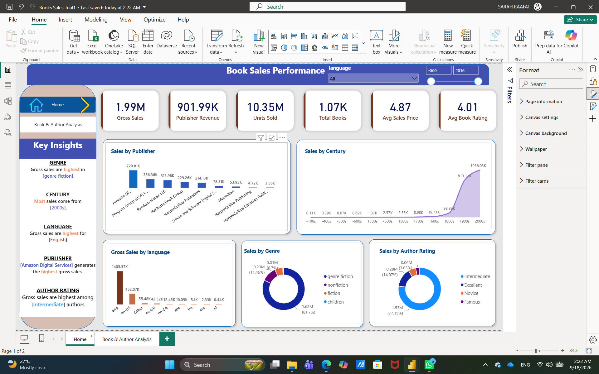

# 📚 Books Sales & Ratings Analysis – Power BI

A Power BI data analysis project focused on exploring book sales, ratings, authors, and publishing trends.

## 📌 Project Overview

The project analyzes a books dataset to understand sales performance, book ratings, author performance, and publishing trends through an interactive Power BI dashboard.

## 📊 Analysis Areas

* 💰 Book Sales and Publisher Revenue
* ⭐ Average Book Ratings
* 📚 Number of Book Ratings
* ✍️ Author Performance
* 📅 Publishing Trends
* 🌍 Books by Language
* 🏷️ Books by Genre
* 📈 Sales and Ratings Insights

## 🛠️ Tools

* Power BI
* Power Query

## 📁 Files

* `Books Sales Trial1.Pbix` – Power BI dashboard and analysis
* `Books_Dashboard_1.png` – Dashboard preview
* `Books_Dashboard_2.png` – Dashboard preview

## 📸 Dashboard Preview

## 🎯 Project Focus

The dashboard provides an interactive view of book sales and ratings to help explore patterns across authors, genres, languages, and publishing years.
