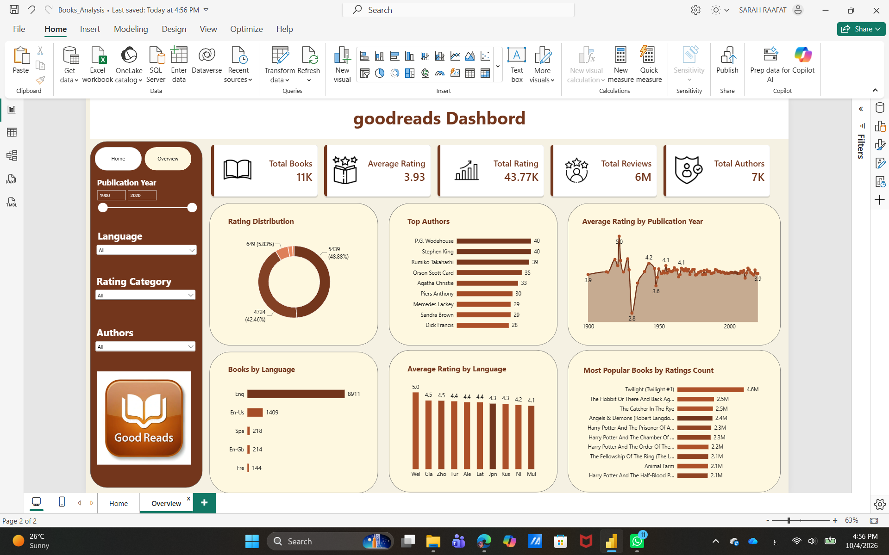

# Goodreads Books Analysis 📚

An interactive data analysis project exploring Goodreads books, ratings, popularity, authors, languages, and publication years using Power BI.

## Dashboard Preview

## Project Overview

This project analyzes Goodreads book data to uncover patterns in book ratings, popularity, author representation, language distribution, and publication trends.

The dataset was cleaned and transformed using Power Query, then analyzed and visualized in Power BI. DAX measures were also used to calculate key metrics and support the analysis.

## Tools & Technologies

* Power BI
* Power Query
* DAX

## Key Metrics

* Total Books
* Average Rating
* Ratings Count
* Reviews Count
* Number of Authors

## Analysis

The analysis explores:

* Rating distribution across books
* Most popular books by ratings count
* Top authors by number of books
* Book distribution by language
* Average rating by language
* Average rating by publication year

## Key Insights

* Most books fall within the Moderate and High rating categories, showing a generally positive rating pattern.
* A small number of titles attract millions of ratings, showing that book popularity is highly concentrated.
* English-language books dominate the dataset by volume.
* A higher number of books within a language does not necessarily mean a higher average rating.
* Average ratings remain relatively stable across most publication years.
* Popularity, ratings, and representation reveal different aspects of the Goodreads dataset when analyzed together.

## Storytelling

The analysis goes beyond individual charts by connecting the findings into a data story — starting with the overall Goodreads landscape, then exploring ratings, popularity, authors, languages, and publication years before bringing the main insights together.

## Project Files

* [Books_Analysis.pbix](Books_Analysis.pbix) — Power BI dashboard and analysis
* [View the Storytelling Presentation](https://canva.link/i1l4yo2uxvwt5n9) — Full presentation and key insights

