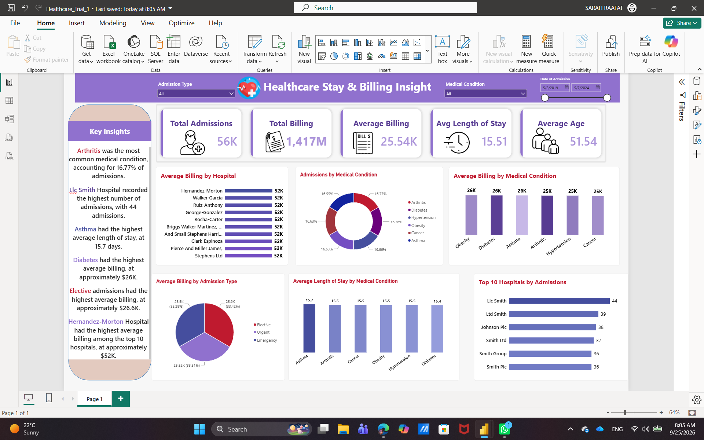

# 🏥 Healthcare Analytics Dashboard – Power BI

A Power BI dashboard project focused on analyzing healthcare data and exploring patient, hospital, medical condition, and billing insights.

## 📌 Project Overview

This project analyzes healthcare records to explore patient demographics, medical conditions, admission types, hospitals, doctors, and billing information through an interactive Power BI dashboard.

## 📊 Analysis Areas

* 👥 Patient Overview
* 🏥 Hospital Analysis
* 🩺 Medical Conditions
* 📋 Admission Types
* 🚻 Gender Analysis
* 🎂 Age Analysis
* 💳 Billing Analysis
* 📈 Healthcare KPIs

## 🛠️ Tools

* Power BI
* Power Query
* DAX

## 🧹 Data Preparation

The dataset was prepared using Power Query, including:

* Checking and correcting data types
* Cleaning text fields using **Trim** and **Proper Case**
* Reviewing numeric values
* Checking for invalid or negative values
* Preparing the data for analysis and modeling

## 📁 Files

* `Healthcare.pbix` – Power BI dashboard
* `Healthcare_dashboard.png` – Dashboard preview

## 📸 Dashboard Preview

## 📚 Dataset

The project uses the **Healthcare Dataset** available on Kaggle.

## 🎯 Project Focus

The dashboard transforms healthcare records into interactive visualizations and KPIs to explore patient demographics, medical conditions, hospital activity, admissions, and billing patterns.
