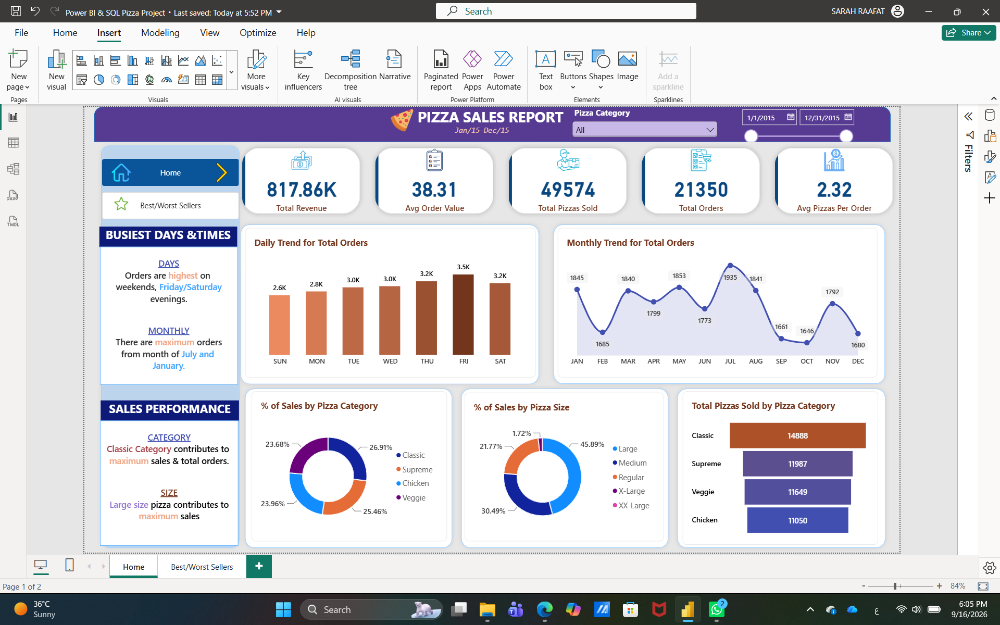
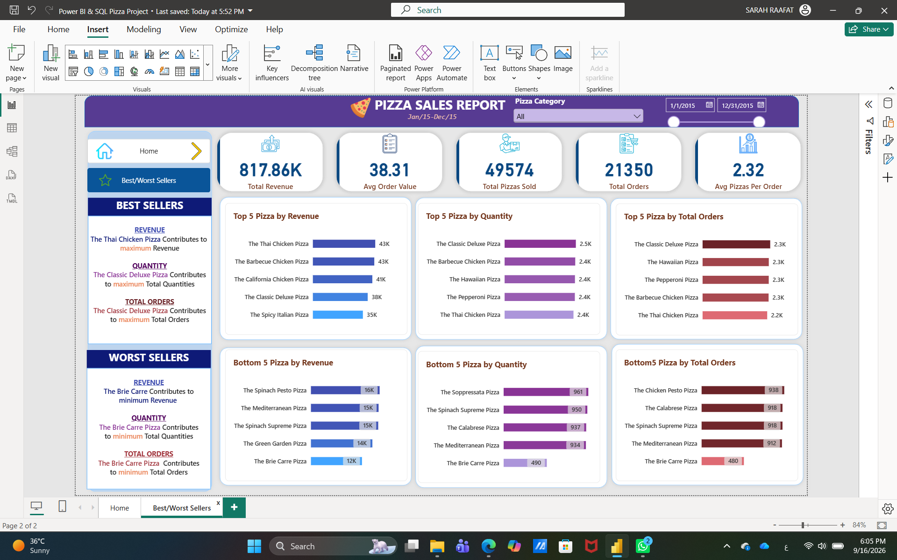

# Pizza Sales Analysis – SQL & Power BI

An end-to-end data analysis project focused on analyzing pizza sales performance using SQL Server and Power BI.

## Project Overview

The project analyzes pizza sales data to identify sales trends, product performance, and key business insights.

## Analysis Areas

* Total Revenue
* Total Orders
* Total Pizzas Sold
* Average Order Value
* Sales Trends Over Time
* Sales by Pizza Category
* Best and Worst Performing Pizzas
* Sales by Day and Month

## Tools

* SQL Server
* Power BI

## Files

* `PizzaDB.sql` – SQL database and analysis queries
* `Power BI & SQL Pizza Project.pbix` – Power BI dashboard
* `Pizza_Dashboard_1.png` – Dashboard preview
* `Pizza_Dashboard_2.png` – Dashboard preview

## Dashboard Preview

## Learning Source

This project was completed as a guided learning project based on a Power BI & SQL tutorial.

[YouTube Tutorial](https://www.youtube.com/watch?v=V-s8c6jMRN0)
