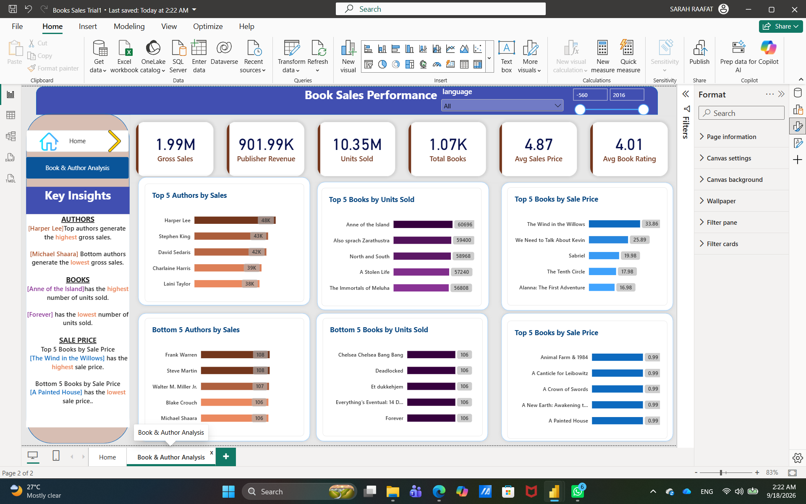
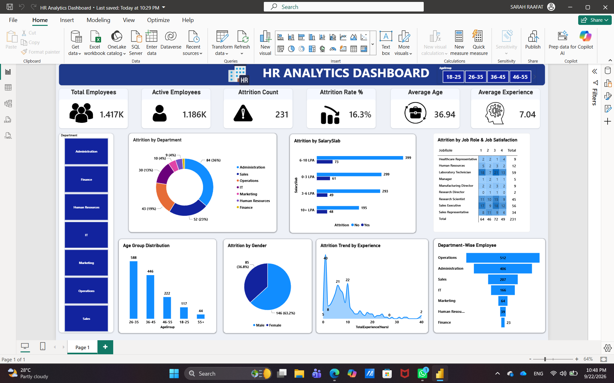
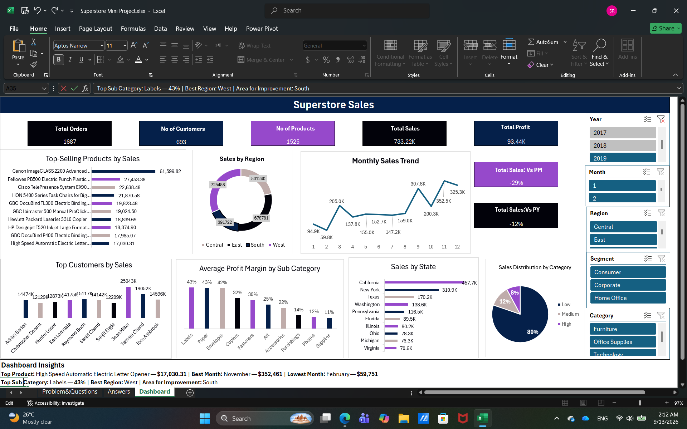

# 📊 DEPI Data Analysis Projects

A collection of Data Analysis projects completed during **DEPI training**, covering **Power BI, Power Query, Excel, SQL, and data modeling**.

---

# 📊 Power BI & Power Query Projects

## 01. Video Game Sales

**File:** [Up_T1_S1_Video_Game_Sales.pbix](Power-BI-Power-Query/Power-BI-Power-Query/Up_T1_S1_Video_Game_Sales.pbix)

**Tools:** Power BI, Power Query

A sales analysis project focused on data cleaning, star schema modeling, and data visualization.

**Key Tasks:**

* Data cleaning and transformation
* Replacing errors
* Building a star schema
* Creating fact and dimension tables
* Data modeling and relationships
* Sales analysis and visualization

**Data Model:**

* Fact_Sales
* Dim_Game
* Dim_Platform
* Dim_Publisher
* Dim_Year

---

## 02. Sales Orders

**File:** [S2_Sales_Orders.pbix](Power-BI-Power-Query/Power-BI-Power-Query/S2_Sales_Orders.pbix)

**Tools:** Power BI, Power Query

A data transformation and modeling project based on a messy sales dataset.

**Key Tasks:**

* Data cleaning and transformation
* Creating custom columns
* Working with dates using locale
* Splitting columns by delimiter
* Pivoting and unpivoting data
* Removing duplicates
* Building a star schema
* Creating relationships between tables

**Data Model:**

* Fact_Sales_Orders
* Dim_Customer
* Dim_Location
* Dim_Product
* Dim_Category

---

## 03. Car Sales

**File:** [T2_S2_Car_Sales.pbix](Power-BI-Power-Query/Power-BI-Power-Query/T2_S2_Car_Sales.pbix)

**Tools:** Power BI, Power Query

A car sales analysis project focused on data cleaning, modeling, and sales visualization.

**Key Tasks:**

* Data cleaning and transformation
* Creating surrogate keys
* Creating price categories
* Building a Date dimension
* Data modeling and relationships
* Sales analysis and visualization

**Data Model:**

* Fact_Sales_2022
* Dim_Cars
* Dim_Customer
* Dim_Seller
* Dim_Date

---

## 04. Coffee Sales

**File:** [Up_T3_S2_Coffee_Sales.pbix](Power-BI-Power-Query/Power-BI-Power-Query/Up_T3_S2_Coffee_Sales.pbix)

**Tools:** Power BI, Power Query

A coffee sales project focused on data profiling, transformation, modeling, and visualization.

**Key Tasks:**

* Data profiling and cleaning
* Removing sensitive Card Number data
* Appending tables
* Creating the final fact table
* Creating price categories
* Cleaning and transforming text
* Creating time periods
* Building a Date dimension
* Data modeling and visualization

**Data Model:**

* Fact_Final_Coffee_Sales
* Dim_Date

---

## 05. Pizza Sales – SQL & Power BI

**Tools:** SQL Server, Power BI

An end-to-end sales analysis project using SQL Server and Power BI.

[View Project →](Pizza-Sales-SQL-PowerBI/)

**Dashboard Preview:**

---

## 06. Books Sales & Ratings

**Tools:** Power BI, Power Query

A Power BI project focused on book sales, publisher revenue, ratings, authors, genres, languages, and publishing trends.

[View Project →](Books-Sales-PowerBI/)

**Dashboard Preview:**

---

## 07. HR Analytics Dashboard

**Tools:** Power BI, Power Query

An HR analytics project focused on employee data, workforce distribution, demographics, departments, hiring trends, and key HR metrics.

[View Project →](HR-Analytics-PowerBI/)

**Dashboard Preview:**

**Learning Source:**

This project was completed as a guided learning project based on a Power BI tutorial.

[YouTube Tutorial](https://www.youtube.com/watch?v=QcTeeBrL6EY)
---

# 📈 Excel & Power Query Projects

## 01. Bakery Sales

**File:** [Bakery trail 2.xlsx](Excel-Power-Query/Bakery-Sales/Bakery%20trail%202.xlsx)

**Tools:** Excel, Power Query

A sales analysis project focused on data cleaning, transformation, time dimensions, and sales summaries.

**Key Tasks:**

* Data profiling and cleaning
* Creating Date and Time dimensions
* Unpivoting product columns
* Merging price information
* Calculating total sales
* Handling null values
* Creating slicers and conditional formatting
* Creating sales summaries

**Project Preview:**

---

## 02. Sales Performance

**File:** [Model1 Trial1.xlsx](Excel-Power-Query/Sales-Performance/Model1%20Trial1.xlsx)

**Tools:** Excel, Power Query

A sales analysis project focused on data cleaning, data modeling, shipping analysis, and Pivot Tables.

**Key Tasks:**

* Data cleaning and transformation
* Handling dates using locale
* Creating a Fact Orders table
* Creating Customer, Location, Product, Order Date, and Ship Date dimensions
* Calculating Shipping Days
* Building a Data Model
* Creating Pivot Tables
* Answering business questions through analysis

**Project Preview:**

---

## 03. Superstore 2019

**Tools:** Excel, Power Query, Power Pivot

A sales and profit analysis project using a structured Excel data model and interactive dashboard.

[View Project →](Superstore-2019/)

**Key Insights:**

* 🥇 High Speed Automatic Electric Letter Opener had the highest sales at **$17,030.31**
* 📅 November recorded the highest monthly sales at **$352,461**
* 📉 February recorded the lowest monthly sales at **$59,751**
* 🏷️ Labels generated the highest share among the categories

**Project Preview:**

---

## 04. Pizza Sales

**Tools:** Excel, Power Query

A sales analysis project based on multiple source tables, data transformation, Pivot Tables, and visualization.

[View Project →](Excel-Power-Query/Pizza-Sales/)

**Project Preview:**

---

# 🗄️ SQL Projects

## SQL Training – IT Gate

A collection of SQL Server training exercises and database projects covering SQL fundamentals and relational database concepts.

[View Repository →](https://github.com/sararaafatmohamed-cmd/SQL-Training-IT-Gate)

**Topics include:**

* SQL fundamentals
* Primary and Foreign Keys
* Table relationships
* Aggregate functions
* GROUP BY
* Subqueries
* Joins
* Many-to-many relationships
* Database design

---

# 🛠️ Tools & Technologies

* Power BI
* Power Query
* Microsoft Excel
* Power Pivot
* SQL Server
* Data Cleaning
* Data Transformation
* Data Modeling
* Data Visualization
* Star Schema

---

# 👩‍💻 Author

**Sara Raafat**

Business Information Systems Student
Aspiring Data Analyst
