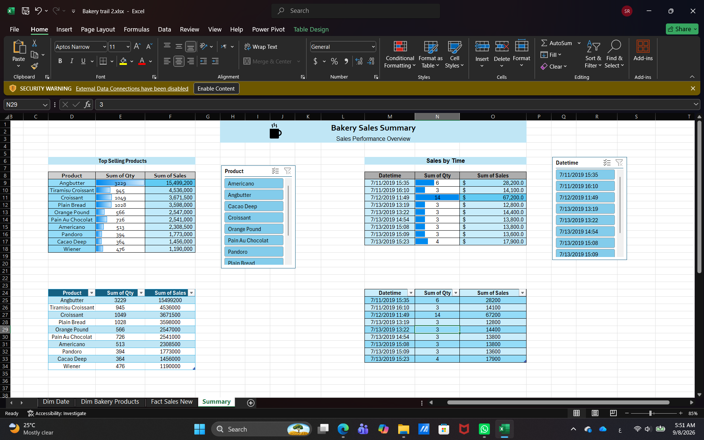
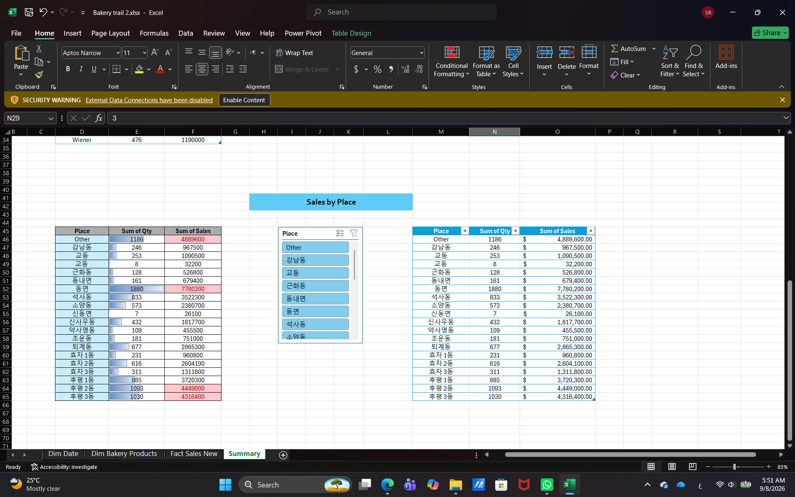
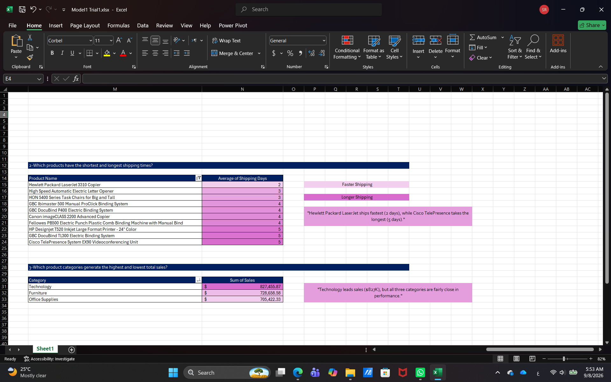
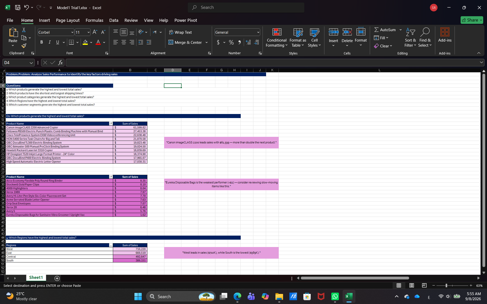
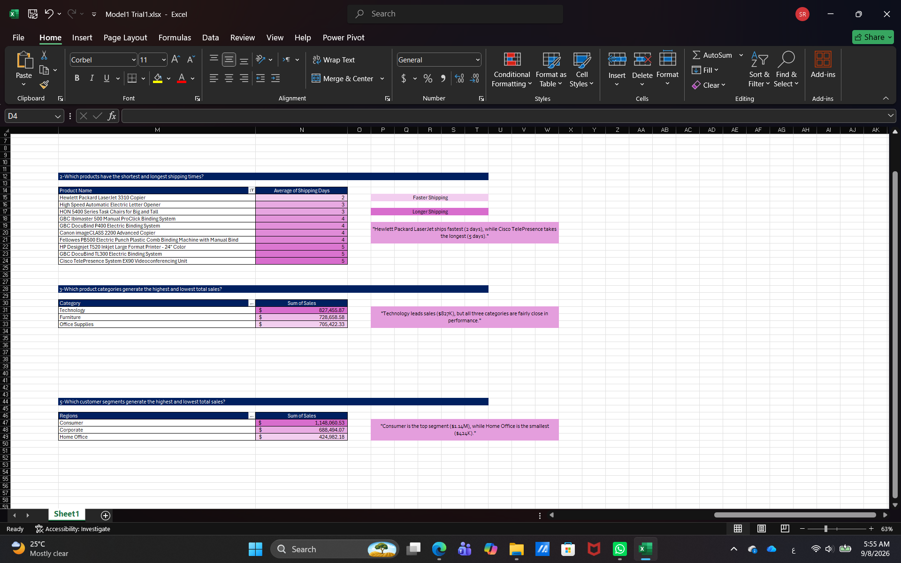
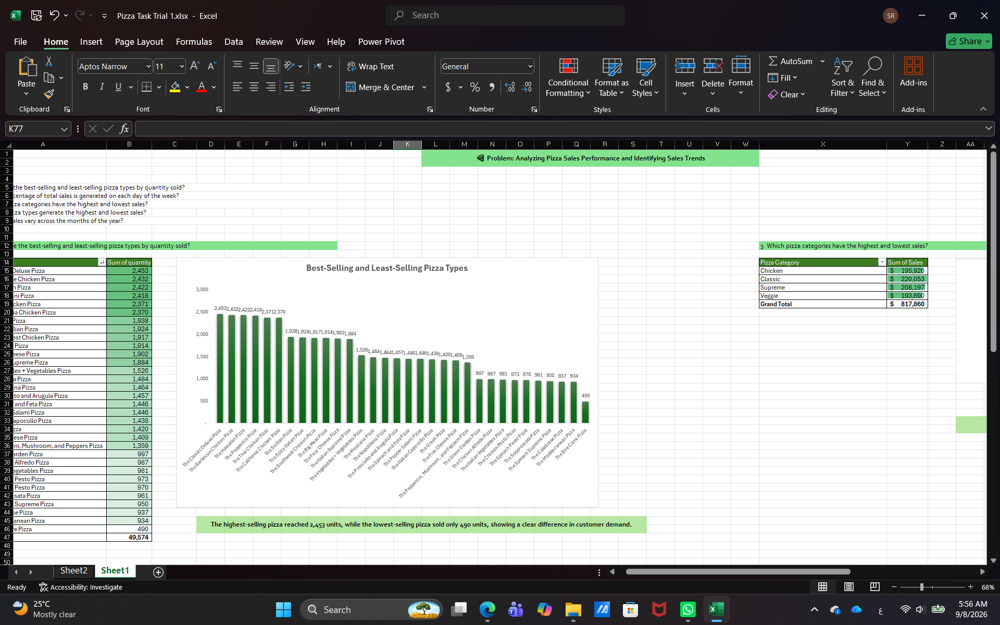
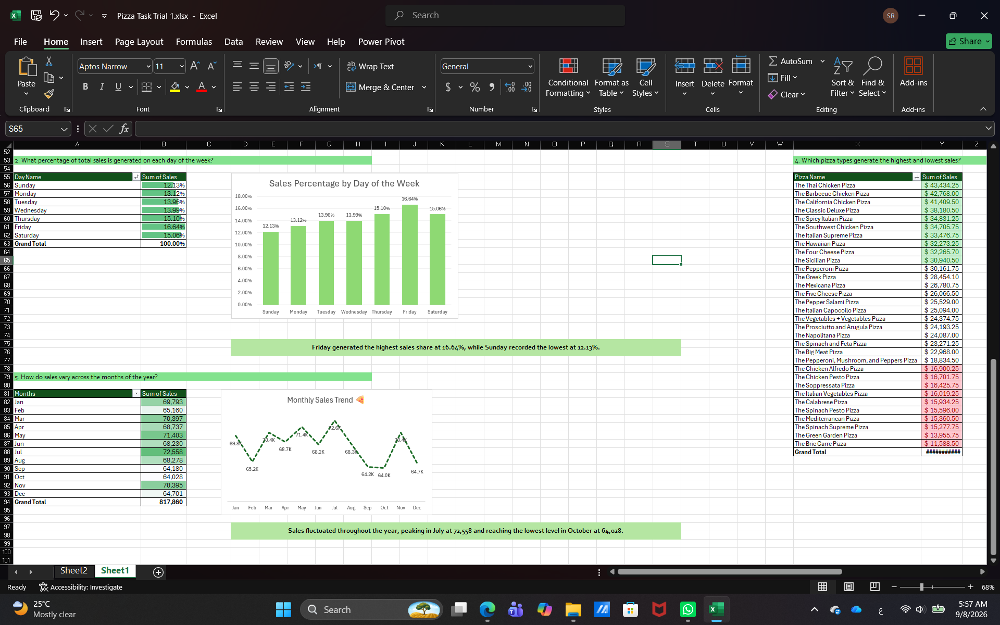
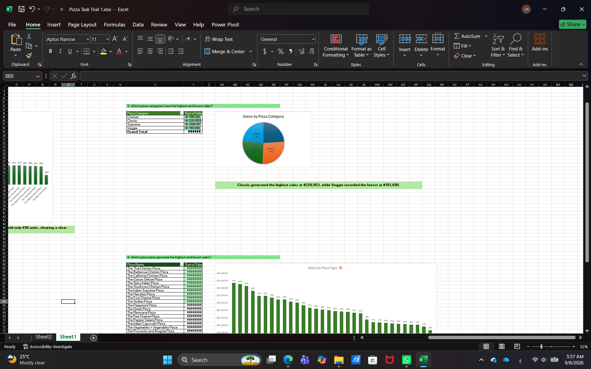
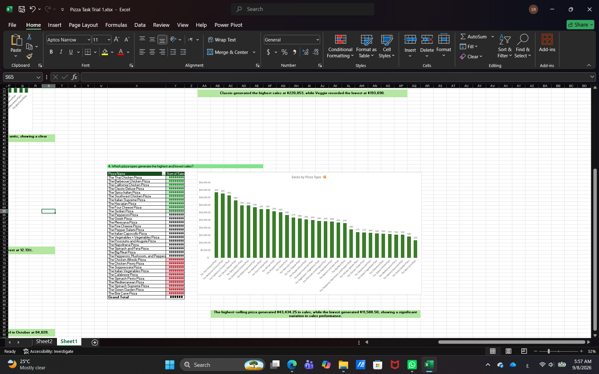

# DEPI Data Analysis Projects

A collection of practical **Data Analysis projects** completed during my **Digital Egypt Pioneers Initiative (DEPI)** training in the Data Analysis track.

These projects focus on **data cleaning, transformation, data modeling, analysis, and business insights** using Power BI, Power Query, and Microsoft Excel.

---

## 📊 Power BI & Power Query Projects

### 01. Video Game Sales

**File:** [01_Video_Game_Sales.pbix](Power-BI-Power-Query/01_Video_Game_Sales.pbix)

**Dataset:** Video Game Sales

#### Key Work

* Performed data cleaning and transformation using Power Query.
* Used Replace Errors for data quality issues.
* Split the dataset into Fact and Dimension tables.
* Created:

  * `Fact_Sales`
  * `Dim_Game`
  * `Dim_Platform`
  * `Dim_Publisher`
  * `Dim_Year`
* Built a structured data model for analysis.

#### Main Concepts

`Power BI` `Power Query` `Data Cleaning` `Data Transformation` `Data Modeling` `Fact & Dimension Tables`

---

### 02. Sales Orders

**File:** [02_Sales_Orders.pbix](Power-BI-Power-Query/02_Sales_Orders.pbix)

**Dataset:** Sales Orders

#### Key Work

* Cleaned and transformed a messy dataset using Power Query.
* Created Fact and Dimension tables.
* Added Custom Columns and Conditional Columns.
* Extracted Year and Month from Order Date.
* Used Split by Delimiter.
* Applied locale settings for date transformation.
* Used Pivot and Unpivot transformations.
* Removed duplicates to ensure unique dimension keys.

#### Main Concepts

`Power BI` `Power Query` `Data Cleaning` `Data Transformation` `Data Modeling` `Pivot` `Unpivot`

---

### 03. Car Sales

**File:** [03_Car_Sales.pbix](Power-BI-Power-Query/03_Car_Sales.pbix)

**Dataset:** Car Sales

#### Key Work

* Created a Fact table and multiple Dimension tables.
* Created custom keys for customers and sellers.
* Added price categories using Conditional Columns.
* Created a Date Dimension.
* Added Year, Month, and Quarter attributes.
* Removed duplicate dimension records.
* Transformed the raw dataset into a structured model suitable for analysis.

#### Main Concepts

`Power BI` `Power Query` `Data Modeling` `Keys` `Date Dimension` `Data Transformation`

---

### 04. Coffee Sales

**File:** [04_Coffee_Sales.pbix](Power-BI-Power-Query/04_Coffee_Sales.pbix)

**Dataset:** Coffee Sales

#### Key Work

* Performed initial data profiling.
* Checked column names, data types, nulls, and errors.
* Removed unnecessary sensitive customer information.
* Cleaned multiple coffee sales tables.
* Appended the sales tables into a final Fact table.
* Created `Fact_Final_Coffee_Sales`.
* Added Price Category classifications.
* Created Time Period classifications.
* Cleaned and standardized text data.
* Created a Date Dimension with Year, Month, and Quarter.

#### Main Concepts

`Power BI` `Power Query` `Data Profiling` `Data Cleaning` `Append` `Data Modeling` `Date Dimension`

---

## 📗 Excel & Power Query Projects

### 01. Bakery Sales

**File:** [Bakery trail 2.xlsx](Excel-Power-Query/Bakery-Sales/Bakery%20trail%202.xlsx)

#### Key Work

* Performed data profiling and cleaning.
* Removed empty and unnecessary columns.
* Created a Date Dimension.
* Used Unpivot to restructure product data.
* Cleaned and standardized product names.
* Merged sales data with product prices.
* Calculated Total Sales using price and quantity.
* Replaced missing place values with `Other`.
* Created Excel summaries.
* Added Slicers.
* Used Conditional Formatting.

#### Analysis

The project includes summaries for:

* Top Selling Products
* Sales by Time
* Sales by Place

#### Project Preview

#### Main Concepts

`Excel` `Power Query` `Data Cleaning` `Unpivot` `Merge` `Custom Column` `Slicers` `Conditional Formatting`

---

### 02. Sales Performance

**File:** [Model1 Trial1.xlsx](Excel-Power-Query/Sales-Performance/Model1%20Trial1.xlsx)

**Problem Statement:**
Analyze Sales Performance to identify the key factors driving sales.

#### Key Work

* Cleaned and transformed order data using Power Query.
* Removed unnecessary system-generated fields.
* Converted dates using Locale.
* Changed Postal Code to Text because it is an identifier rather than a measure.
* Created Fact and Dimension tables.
* Created:

  * `Fact Orders`
  * `Dim Customer`
  * `Dim Location`
  * `Dim Product`
  * `Dim Order Date`
  * `Dim Ship Date`
* Calculated Shipping Days.
* Removed duplicate dimension records.
* Created Year and Month attributes.
* Built relationships using the Excel Data Model.
* Created Pivot Tables to answer business questions.

#### Business Questions

1. Which products generate the highest and lowest total sales?
2. Which products have the shortest and longest shipping times?
3. Which product categories generate the highest and lowest total sales?
4. Which regions have the highest and lowest total sales?
5. Which customer segments generate the highest and lowest total sales?

#### Project Preview

#### Main Concepts

`Excel` `Power Query` `Data Cleaning` `Data Modeling` `Data Model` `Pivot Tables` `Business Analysis`

---

### 03. Pizza Sales

**File:** [Pizza Task Trail 1.xlsx](Excel-Power-Query/Pizza-Sales/Pizza%20Task%20Trail%201.xlsx)

**Problem Statement:**
Analyze Pizza Sales Performance and identify sales trends.

#### Key Work

* Built a Star Schema.
* Created a Fact table from transactional data.
* Merged the Fact table with pizza data to obtain prices.
* Calculated Total Sales.
* Merged order information to obtain Date and Time.
* Created a Pizza Dimension.
* Merged pizza information with Pizza Types.
* Created a Date Dimension.
* Added Year, Month Name, and Day Name.
* Created Pivot Tables and Charts for analysis.

#### Business Questions

1. What are the best-selling and least-selling pizza types by quantity sold?
2. What percentage of total sales is generated on each day of the week?
3. Which pizza categories generate the highest and lowest sales?
4. Which pizza types generate the highest and lowest sales?
5. How do sales vary across the months of the year?

#### Project Preview

#### Main Concepts

`Excel` `Power Query` `Star Schema` `Data Modeling` `Pivot Tables` `Data Visualization` `Sales Analysis`

---

## 🛠️ Tools & Skills

### Tools

* Power BI
* Power Query
* Microsoft Excel

### Data Analysis Skills

* Data Cleaning
* Data Profiling
* Data Transformation
* Data Modeling
* Fact & Dimension Tables
* Star Schema
* Data Integration
* Pivot Tables
* Data Visualization
* Business Questions & Insights

### Power Query Techniques

* Merge
* Append
* Pivot
* Unpivot
* Split by Delimiter
* Replace Values
* Replace Errors
* Conditional Columns
* Custom Columns
* Remove Duplicates
* Date & Time Transformations
* Text Cleaning

---

## 🎯 Learning Outcomes

Through these projects, I gained hands-on experience in:

* Preparing raw datasets for analysis.
* Identifying and handling data quality issues.
* Transforming unstructured data into analysis-ready datasets.
* Designing Fact and Dimension tables.
* Building structured data models.
* Applying Power Query transformations.
* Using Excel Pivot Tables and Charts to answer business questions.
* Extracting meaningful insights from sales data.

---

## 👩‍💻 About Me

**Sara Raafat**
Business Information Systems Student | Aspiring Data Analyst

I am interested in **Data Analysis, Business Intelligence, and Data Visualization**, with a focus on continuous learning and developing practical analytical skills.

### Connect with me

* GitHub
* LinkedIn
* Portfolio
