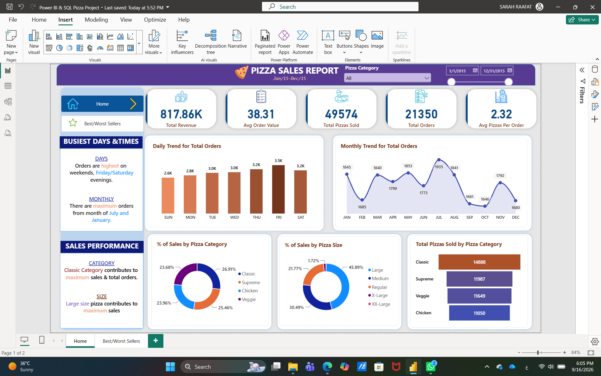
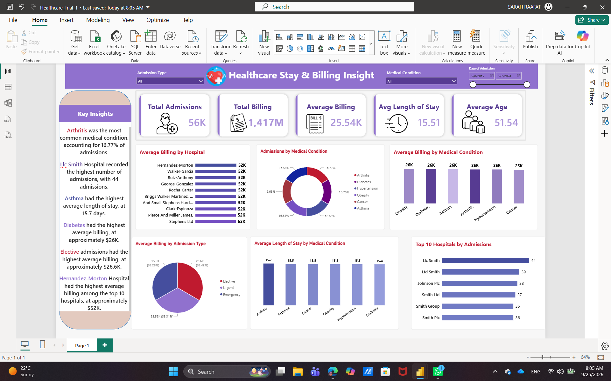
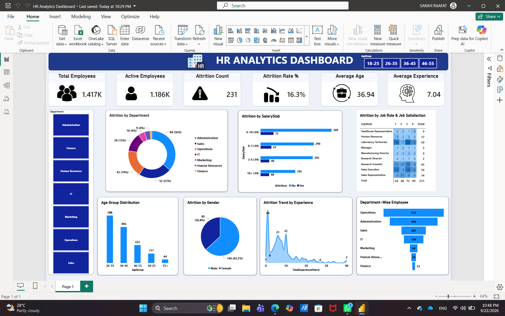
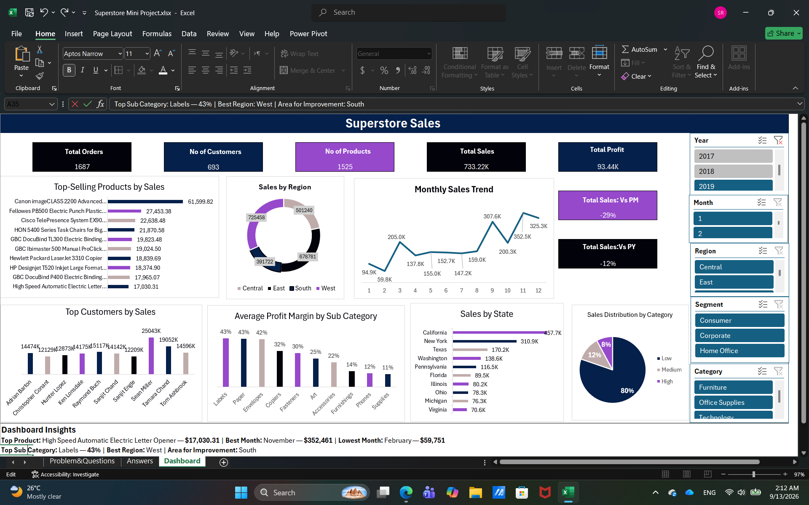

# 📊 DEPI Data Analysis Projects

A collection of selected **Data Analysis projects developed during my DEPI training**, focusing on **SQL, Power BI, Power Query, DAX, Excel, data modeling, and data visualization**.

These projects showcase my ability to transform raw data into **interactive dashboards, meaningful insights, and data-driven stories**.

---

# 🚀 Featured Projects

## 01. 📚 Goodreads Books Analysis

**Tools:** Power BI · Power Query · DAX

An interactive analysis of books and ratings, exploring authors, publication years, languages, and rating patterns.

**Highlights:**

* Data cleaning and transformation
* Data modeling
* DAX measures
* Rating analysis
* Author and language analysis
* Publication year trends
* Interactive dashboard
* Data storytelling

**Dashboard Preview:**

[🔗 View Project →](Goodreads-Books-Analysis/)

---

## 02. 🍕 Pizza Sales — SQL & Power BI

**Tools:** SQL Server · Power BI · DAX

An end-to-end sales analysis project combining SQL Server and Power BI to evaluate sales performance and identify business trends.

**Highlights:**

* SQL data analysis
* Revenue and order analysis
* Sales by category and pizza type
* Daily and monthly sales trends
* KPI development
* Interactive dashboard

**Dashboard Preview:**

[🔗 View Project →](Pizza-Sales-SQL-PowerBI/)

---

## 03. 🏥 Healthcare Analytics

**Tools:** Power BI · Power Query · DAX

An interactive healthcare dashboard analyzing patient admissions, medical conditions, hospitals, and billing data.

**Highlights:**

* Data cleaning and transformation
* Healthcare KPI analysis
* Patient analysis
* Medical condition analysis
* Hospital analysis
* Admission trends
* Interactive dashboard

**Dashboard Preview:**

[🔗 View Project →](Healthcare-Analytics-PowerBI/)

---

## 04. 👥 HR Analytics

**Tools:** Power BI · Power Query · DAX

An HR analytics dashboard exploring employee demographics, departments, workforce distribution, hiring trends, and key HR metrics.

**Highlights:**

* Employee data analysis
* Workforce distribution
* Demographic analysis
* Department analysis
* Hiring trends
* HR KPIs
* Interactive dashboard

**Dashboard Preview:**

[🔗 View Project →](HR-Analytics-PowerBI/)

---

## 05. 🛒 Superstore 2019

**Tools:** Excel · Power Query · Power Pivot

A sales and profitability analysis project built using a structured Excel data model to explore sales, profit, customers, products, and shipping performance.

**Highlights:**

* Data cleaning and transformation
* Data modeling
* Sales and profit analysis
* Customer analysis
* Product analysis
* Shipping analysis
* Interactive dashboard

**Dashboard Preview:**

[🔗 View Project →](Superstore-2019/)

---

## 06. 🚕 Uber Analytics

**Tools:** Power BI · Power Query · DAX

An interactive Power BI dashboard analyzing Uber trip data to identify patterns across time, locations, trips, and key performance indicators.

**Highlights:**

* Data cleaning and transformation
* Trip analysis
* Revenue analysis
* Time-based analysis
* Location analysis
* KPI development
* Interactive dashboard

**Dashboard Preview:**

[🔗 View Project →](Uber-Analytics-PowerBI/)

---

# 🛠️ Tools & Technologies

| Category             | Tools                                                                                                |
| -------------------- | ---------------------------------------------------------------------------------------------------- |
| **Data Analysis**    | SQL · Power BI · DAX                                                                                 |
| **Data Preparation** | Power Query · Excel                                                                                  |
| **Data Modeling**    | Star Schema · Power Pivot                                                                            |
| **Visualization**    | Power BI · Excel                                                                                     |
| **Core Skills**      | Data Cleaning · Data Transformation · Data Visualization · Business Insights · Dashboard Development |

---

# 👩‍💻 About Me

**Sara Raafat**
Business Information Systems Student | Aspiring Data Analyst

I am passionate about turning raw data into **clear visualizations, meaningful insights, and data-driven stories**.

My main focus is **Data Analysis, SQL, and Power BI**, with a strong interest in building practical analytical solutions.

---
