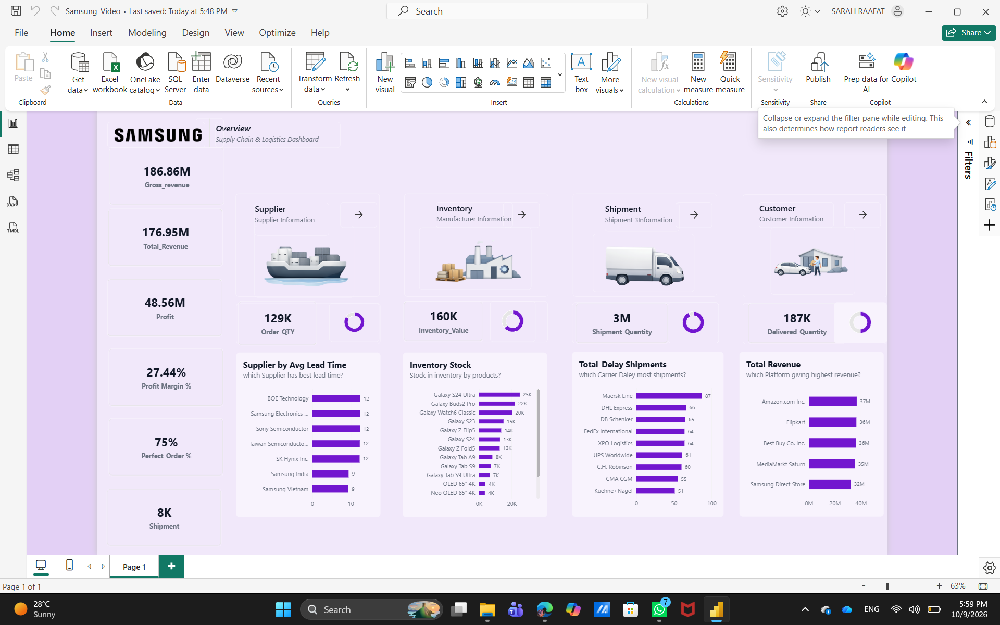

# Samsung Supply Chain & Logistics Dashboard | Power BI

## 📌 Project Overview

This project presents an interactive Power BI dashboard designed to analyze Samsung's supply chain and logistics operations.

The dashboard provides an overview of revenue, profitability, inventory, suppliers, shipments, and customer-related metrics, helping users explore operational performance and identify areas for further analysis.

## 🎯 Business Objectives

* Monitor revenue, profit, and profit margin.
* Analyze supplier lead times and compare supplier performance.
* Explore inventory distribution across products.
* Identify shipping carriers with the highest shipment delays.
* Compare revenue across different sales platforms.
* Monitor shipment quantities and delivered quantities.
* Evaluate perfect order performance.

## 🛠️ Tools & Technologies

* **Microsoft Power BI** — Interactive dashboards and data visualization
* **DAX** — Measures and KPI calculations
* **Power Query** — Data preparation and transformation
* **Data Modeling** — Organizing data for analysis

## 📊 Key Performance Indicators

| KPI                | Dashboard Value |
| ------------------ | --------------: |
| Gross Revenue      |         186.86M |
| Total Revenue      |         176.95M |
| Profit             |          48.56M |
| Profit Margin      |          27.44% |
| Perfect Order      |             75% |
| Shipment Count     |              8K |
| Order Quantity     |            129K |
| Inventory Value    |            160K |
| Shipment Quantity  |              3M |
| Delivered Quantity |            187K |

*Values are displayed as shown in the dashboard. Units and definitions depend on the underlying dataset and measure calculations.*

## 📈 Dashboard Analysis

### 1. Supplier Performance

Compares suppliers by average lead time to explore differences in delivery timelines.

### 2. Inventory Analysis

Visualizes stock distribution across Samsung products to support inventory monitoring.

### 3. Shipment Delay Analysis

Compares shipping carriers by shipment delays to identify carriers that may require further investigation.

### 4. Revenue by Platform

Compares revenue across sales platforms, including Amazon, Flipkart, Best Buy, MediaMarkt Saturn, and Samsung Direct Store.

### 5. Operational Performance

Provides an overview of order quantities, shipment volumes, delivered quantities, and perfect order performance.

## 🖼️ Dashboard Preview

## 📁 Project Files

* `Samsung_Video.pbix` — Power BI report file
* `Samsung_Dashboard.png` — Dashboard preview

## 📚 Learning Resource

This project was developed as a hands-on learning exercise by following a guided Power BI tutorial.

[Power BI Project: Complete Dashboard Tutorial 2026 | Data Analyst](https://www.youtube.com/watch?v=UqrsTIiOnO4)

## 👩‍💻 Author

**Sara Raafat**

Business Information Systems Student | Aspiring Data Analyst

[GitHub Profile](https://github.com/sararaafatmohamed-cmd) · [LinkedIn Profile](https://www.linkedin.com/in/sarah-raafat-639a88259/)

---

*Continuously learning and building practical projects in Data Analysis and Business Intelligence.*
