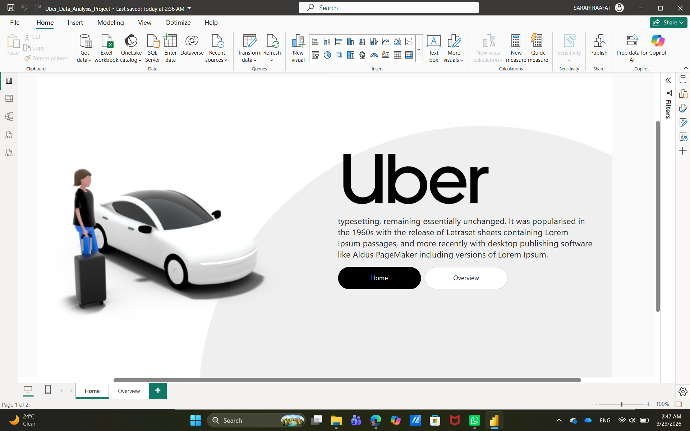
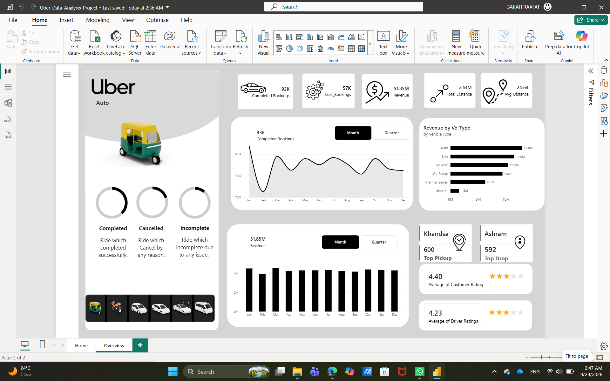

# 🚕 Uber Analytics Dashboard – Power BI

A Power BI practice project focused on analyzing Uber trip data and building an interactive analytics dashboard.

## 📌 Project Overview

This project explores Uber trip data to analyze booking trends, revenue, ride patterns, payment methods, vehicle performance, and customer-related insights.

The project was completed as a **guided learning project** based on a Power BI tutorial by **The Developer**, with hands-on practice of the concepts and techniques demonstrated in the tutorial.

## 📊 Analysis Areas

* 🚕 Booking Trends
* 💰 Revenue Analysis
* 📈 Ride Patterns
* 💳 Payment Methods
* 🚗 Vehicle Performance
* 👥 Customer Insights

## 🛠️ Tools & Technologies

* Power BI
* Power Query
* DAX
* Data Modeling
* Data Visualization

## 📈 Key Skills Practiced

* Data preparation and transformation
* Data modeling
* Creating DAX measures
* KPI development
* Interactive visualizations
* Dashboard design
* Data storytelling

## 📁 Files

* `Uber_Data_Analysis_Project.pbix` – Power BI dashboard
* `Uber_Dashboard1.png` – Dashboard preview
* `Uber_Dashboard2.png` – Dashboard preview

## 📸 Dashboard Preview

## 📚 Learning Source

This project was completed as a guided learning project based on:

**Power BI Dashboard Design: Real-World Uber Data Analysis Project Tutorial – The Developer**

🎥 [Watch the Tutorial](https://www.youtube.com/watch?v=lkMYkUMz4RM)

## 🎯 Project Focus

The main goal of this project was to strengthen practical Power BI skills by applying data modeling, DAX, dashboard design, and visualization techniques to an Uber analytics scenario.
